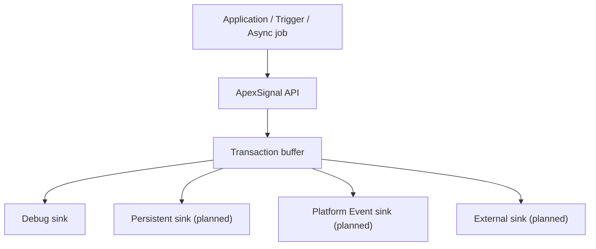

# ApexSignal Logging Framework

**Structured logging and operational evidence for Salesforce.**

ApexSignal is a standalone Apex logging framework for producing useful, correlated and extensible diagnostic records without scattering `System.debug()` calls across application code.

> Systems must not lie. Logs should describe what happened, where it happened, and how related work fits together.

## Status

ApexSignal is an early portfolio and learning project. The v0.1 foundation currently provides:

- structured log entries;
- `DEBUG`, `INFO`, `WARN`, `ERROR` and `FATAL` levels;
- transaction and caller-supplied correlation identifiers;
- contextual key/value data;
- exception type, message and stack trace capture;
- governor-limit snapshots;
- transaction-scoped buffering;
- explicit bulk `flush()`;
- pluggable sink interface;
- a default debug-log sink;
- fail-open or fail-closed sink behaviour;
- Apex unit tests.

Persistent storage, Platform Events, Custom Metadata configuration, redaction, retention and an LWC explorer are planned extensions.

## Why ApexSignal?

A production incident rarely begins with a tidy exception. A request may cross triggers, services, Queueables, integrations and batch jobs. ApexSignal treats observability as an application design concern:

1. create or accept a correlation ID;
2. emit structured events as work progresses;
3. accumulate entries in memory;
4. flush the buffer through one or more sinks;
5. search or forward those events outside the transaction.

ApexSignal is independent of any trigger, batch or integration framework. Other projects can depend on its public API or provide an adapter without creating a circular dependency.

## Quick start

```apex
ApexSignal.setCorrelationId(inboundCorrelationId);
ApexSignal.context('recordId', opportunityId);
ApexSignal.context('operation', 'closeWon');

try {
    ApexSignal.info('Starting Closed Won processing');
    opportunityService.closeWon(opportunityId);
    ApexSignal.info('Closed Won processing completed');
} catch (Exception error) {
    ApexSignal.error('Closed Won processing failed', error);
    throw error;
} finally {
    ApexSignal.flush();
}
```

Add structured data to one event:

```apex
ApexSignal.log(
    ApexSignalLevel.INFO,
    'Pricing decision completed',
    new Map<String, Object>{
        'opportunityId' => opportunityId,
        'priceBookId' => priceBookId,
        'outcome' => 'APPROVED'
    }
);
```

## Architecture



See [Architecture](docs/ARCHITECTURE.md), [Roadmap](docs/ROADMAP.md), and [Contributing](CONTRIBUTING.md).

## Design principles

- **Structured over textual** — fields can be filtered and aggregated.
- **Correlated by default** — related events share one identifier.
- **Bulk-safe** — entries are buffered and sinks receive a collection.
- **Explicit finalisation** — callers choose the correct transaction boundary for `flush()`.
- **Extensible** — storage and transport are sink concerns.
- **Secure by design** — never log secrets; automated redaction is on the roadmap.
- **Honest failure semantics** — fail-open is the default, but strict workflows can choose fail-closed.
- **Standalone** — no dependency on ApexRail or a particular application.

## Local development

This is a Salesforce DX project.

```bash
sf org create scratch --definition-file config/project-scratch-def.json --alias apexsignal
sf project deploy start --target-org apexsignal
sf apex run test --target-org apexsignal --test-level RunLocalTests --wait 20
```

## Author

Designed and maintained by **George Wiafe**.

## License

MIT — see [LICENSE](LICENSE).
