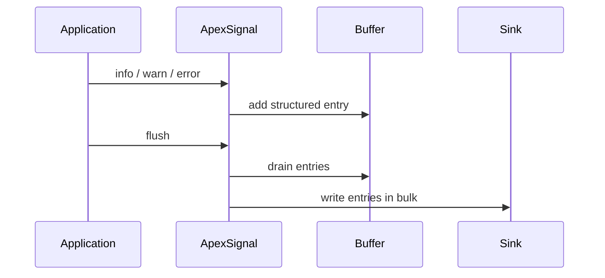

# ApexSignal architecture

## Purpose

ApexSignal records structured operational evidence within Salesforce transactions. It separates the application-facing logging API from buffering and delivery concerns.

## Components

| Component | Responsibility |
|---|---|
| `ApexSignal` | Static application API, correlation and shared transaction context |
| `ApexSignalEntry` | Serializable structured event |
| `ApexSignalBuffer` | Transaction-scoped in-memory collection |
| `ApexSignalSink` | Extension contract for destinations |
| `ApexSignalDebugSink` | Initial sink that emits JSON to Salesforce debug logs |
| `ApexSignalLimits` | Captures selected governor-limit usage |

## Transaction lifecycle

A log call performs no DML and no callout. `flush()` drains the current buffer and sends the same immutable batch view to each registered sink.

## Correlation

ApexSignal generates a transaction correlation ID lazily. An inbound REST request, Platform Event, Queueable or batch scope may replace it with an existing correlation ID. Async producers should explicitly carry the ID into the next transaction.

## Failure policy

Fail-open is the default: a sink failure is reported through `System.debug` and does not replace the business exception. A caller can select fail-closed when log delivery is itself a business requirement. Sinks must never call ApexSignal recursively.

## Security boundary

Context is application supplied and therefore untrusted. Callers must not log passwords, tokens, session identifiers, payment data or unnecessary personal information. A redaction pipeline is planned before persistent sinks are introduced.

## Transaction rollback

A sink that writes ordinary records in the same transaction is subject to rollback. A future durable design must make the delivery semantics explicit rather than claim that every failure can always be preserved.
